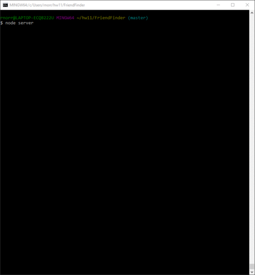

# FriendFinder
A web app that utilizes Node and Express to couple a user's survey answers with people who have similar answers. Find that friend!

Friend Finder is a web app designed to pair you with other users based on compatibility. That compatibility is found through comparing the survey answers of the current user with those defined in an array within the app. Once the user selects their answers to the questions and submits them, they will be paired with one of those array users and a modal will appear showing the result. Try it out for yourself and see who you are matched with!

Process GIF:

Required NPM modules:
- express
- body-parser

Steps to get it running
1. Run "node server" (no quotes) in CLI
2. Navigate to "http://localhost:3000/" (no quotes)
3. Take survey!

CLI command to close server:
- CTRL/Command c

Have Fun and Find a Friend!